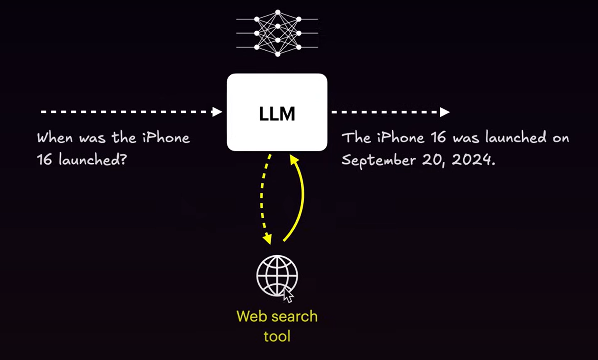
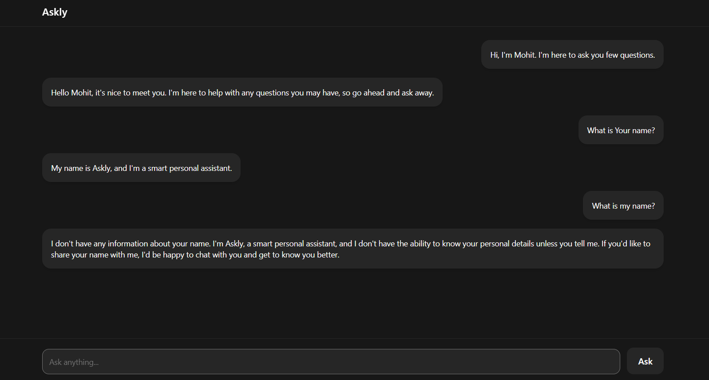
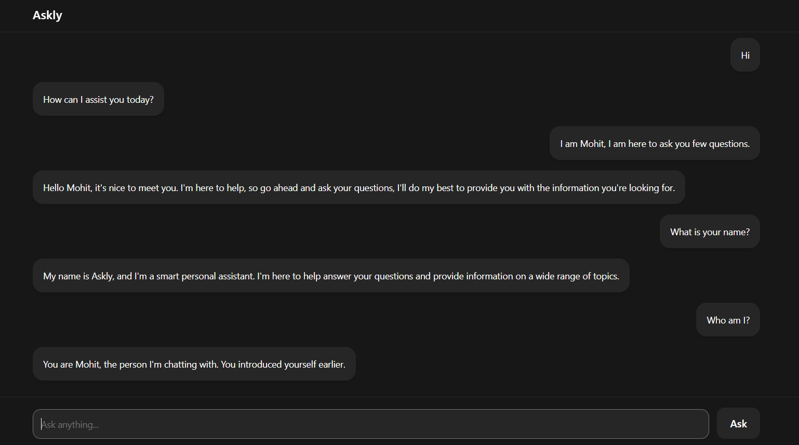
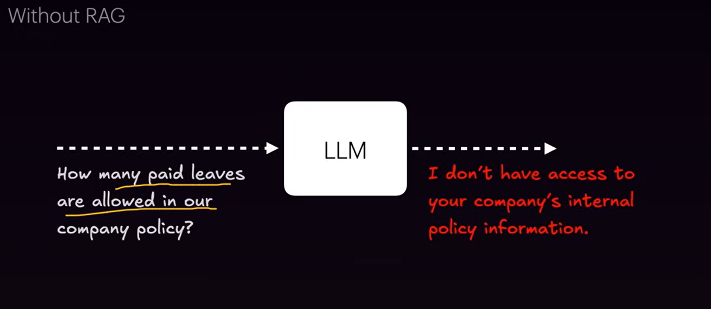
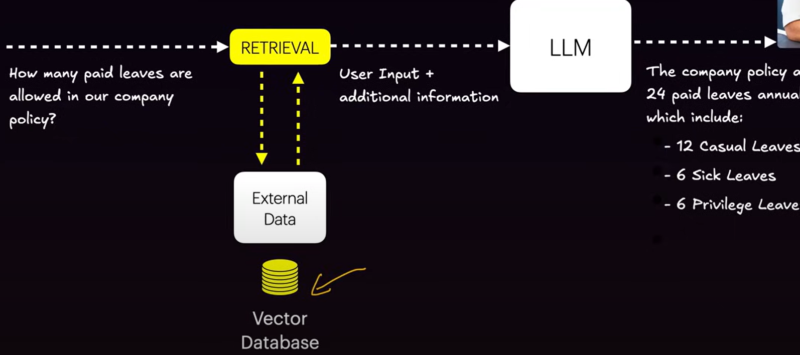

# 🧠 Generative AI Notes for 2025

## 📘 Table of Contents

1. [What is Generative AI?](#1-what-is-generative-ai)
2. [Why Use Generative AI?](#2-why-use-generative-ai)
3. [How Does Generative AI Work?](#3-how-does-generative-ai-work)
4. [Architecture of Generative AI Models (Transformers)](#4-architecture-of-generative-ai-models-transformers)
5. [Introduction to LLMs](#5-introduction-to-llms)
6. [How does LLM Work?](#6-how-does-llms-work)
7. [What Was the Process of Text Generation Before LLMs?](#7-what-was-the-process-of-text-generation-before-llms)
8. [GPT Models VS Reasoning Models](#9-gpt-models-vs-reasoning-models)
9. [Token, Context, Context Window & Inference](#10-token-context-context-window--inference)
10. [Introduction of Prompt Engineering](#11-introduction-of-prompt-engineering)
11. [Types of Prompting in LLMs](#12-types-of-prompting-in-llms)
12. [Invoking the LLM](#13-invoking-the-llm)
13. [About System Prompt](#14-about-system-prompt)
14. [LLM Settings / Parameters Explained](#15-llm-settings--parameters-explained)
15. [Structured Output in LLMs](#16-structured-output-in-llms)
16. [Introducing Tool Calling](#17-introducing-tool-calling)
17. [Adding Memory to Chatbot](#-18-adding-memory-to-chatbot)
18. [Overview of RAG](#19-overview-of-rag)
19. [Overview of Agentic AI](#20-overview-of-agentic-ai)
20. [LangChain Vs LangGraph](#21-langchain-vs-langgraph)
21. [Why LangGraph?](#22-why-langgraph)
22. [ReAct Agent — The Foundation of Agentic AI](#22-react-agent--the-foundation-of-agentic-ai)

---

## 1. What is Generative AI?

**Generative AI** is a type of **Artificial Intelligence (AI)** that can **create new content**, such as **text, images, audio, video, or even code**.

It works by combining the power of **Machine Learning (ML)** and **Deep Learning (DL)**. These models learn from large datasets.

---

## 2. Why Use Generative AI?

The main purpose of **Generative AI** is to **enhance productivity and creativity** by automating tasks that usually require human input.

### 💡 Real-Life Use Cases

1. **Faster Content Creation:**  
   Generate blogs, social media posts, and email templates within seconds.

2. **Code Generation & Programming Assistance:**  
   Helps in writing code, fixing bugs, and generating functions automatically.

3. **Design & Creativity:**  
   Create images, logos, music, or even 3D models with minimal manual effort.

4. **Automation:**  
   Power chatbots, AI assistants, and automated report generation to save time and resources.

---

## 3. How Does Generative AI Work?

### 🧠 The Brain of AI — Neural Networks

A **Neural Network** is a system inspired by how the **human brain** works.  
It processes information through interconnected nodes called **neurons**.


### 🧩 Structure of a Neural Network

- **Input Layer:** Receives raw data
- **Hidden Layers:** Learn patterns and relationships
- **Output Layer:** Produces the final prediction or result

**Example:**

```
If we ask the AI to identify photos of cats and dogs,
the neural network learns features such as ear shape, whiskers, and color patterns —
then predicts: “This is a Cat.”
```

### ⚙️ From Neural Networks → Deep Learning → Transformers

Traditional neural networks struggled with **sequential data** (like text),  
because the **meaning of words changes based on context**.

**Example:**

```
The word “bank” could mean a river bank or a money bank —
so the model needs to understand the context.
```

That’s where the hero comes in — the **Transformer Architecture**  
(introduced by Google in 2017 through the paper _“Attention is All You Need”_).  
This architecture handles **context understanding** using the **Self-Attention Mechanism**.

### ✨ Self-Attention Mechanism — The Real Magic

**Self-Attention** means the model looks at every word in relation to all other words in the sentence.  
It figures out how important each word is to understanding the others.

**Example:**

```
Sentence: “The cat sat on the mat.”


The model checks relationships like:
- “cat” → related to “sat”, “mat”
- “mat” → used in the context of “on”

By analyzing these relationships, the model builds **contextual understanding**,
allowing it to generate more meaningful and accurate results.
```

---

## 4. Architecture of Generative AI Models (Transformers)

The **Transformer architecture** is the backbone of almost all modern Generative AI models —  
like **GPT (OpenAI)**, **Gemini (Google)**, **Claude (Anthropic)**, and **LLaMA (Meta)**.

Introduced in 2017 by Google in the paper _“Attention is All You Need”_,  
Transformers revolutionized how machines understand and generate language.


### 🧩 Core Components of a Transformer

A typical Transformer model has two main parts:

#### 1. **Encoder**

- Takes input data (like a sentence) and converts it into **contextual embeddings**.
- Understands the **meaning and relationships** between words.
- Used in models like **BERT** (for understanding language).

#### 2. **Decoder**

- Takes the encoder’s output (or its own previous output) to **generate new text or data**.
- Used in models like **GPT** (for generating text).

> 🧠 Some models use both (Encoder–Decoder),  
> while others use only one part depending on their purpose.

### ⚙️ Inside Each Encoder/Decoder Block

Each block contains:

1. **Self-Attention Layer:**  
   Learns which words or tokens are important in relation to others.  
   Example — In the sentence _“The cat sat on the mat”_,  
   the model knows “cat” relates more to “sat” than to “mat”.

2. **Feed Forward Neural Network (FFN):**  
   Processes the attention output and refines the learned representation.

3. **Layer Normalization:**  
   Stabilizes and speeds up training by keeping values balanced.

4. **Residual Connections:**  
   Help prevent information loss by adding input values back into outputs (skip connections).

---

## 5. Introduction to LLMs

**LLM** stands for **Large Language Model**. It is a type of **Generative AI model** specifically trained to **understand and generate human language (text)**.

### 🧠 Important Concepts

- The word _“Large”_ refers to models containing **billions or even trillions of parameters**. These **parameters** represent the model’s internal “knowledge” — how it maps words, meanings, and context together.
- LLMs are trained on enormous datasets including **books, websites, articles, code, and conversations**, allowing them to develop a strong understanding of **real-world knowledge and language structure**.
- LLMs are capable of performing a wide range of tasks such as **summarization, translation, question answering, code generation, and reasoning**.

### ⚙️ Example

- **GPT-3:** ~175 Billion parameters
- **GPT-4:** Estimated to have **trillions of parameters** (exact numbers are undisclosed)

---

## 6. How does LLMs Work?

An **LLM (Large Language Model)** is essentially a **next-word prediction machine**, but at a highly intelligent level.

### ⚙️ Flow of Operation

1. You provide a **prompt** — for example: _“Delhi is the capital of …”_
2. The model uses its **training data** and **parameters** to predict the most likely next word — in this case, _“India”_.
3. This prediction process continues **word by word**, using previous outputs as context, until the **complete response** is generated.

---

## 7. What Was the Process of Text Generation Before LLMs?

Before **LLMs**, text generation relied on **rule-based** and **statistical models**. These systems used predefined language rules and probability patterns but had **limited context understanding**.

### 🧩 Main Techniques Used Before LLMs

1. **Rule-Based Models (Pre-2000s)**

   - Manually defined “if-then” rules.
   - Example: If input = “Hello”, response = “Hi! How are you?”
   - ❌ No creativity — only fixed responses.

2. **Statistical Language Models (2000s)**

   - Used **n-grams** (word sequences) to predict the next word.
   - Example: “I love …” → predicts “India” if it appears frequently in data.
   - ❌ Could remember only short context (2–3 words).

3. **RNNs (Recurrent Neural Networks – 2010s)**

   - Could remember previous words for short sequences.
   - Example: “I am going to New …” → predicts “York”.
   - ❌ Struggled with long sentences and slow training.

4. **LSTMs & GRUs (2014–2017)**

   - Improved memory and stability over RNNs.
   - Used in early chatbots like Siri and Google Assistant.
   - ❌ Still failed at long context and creative text generation.

5. **Transformers (2017 – “Attention is All You Need”)**
   - Introduced **Self-Attention Mechanism**, enabling long-context understanding.
   - Formed the base for modern **LLMs** like **GPT**, **BERT**, and **T5**, starting the true AI revolution.

---

## 8. GPT Models vs Reasoning Models

### GPT Models (Generative Models)

**Definition:** GPT models are primarily built to **generate text** by predicting the next word based on a prompt.

**Capabilities:** Text generation (blogs, stories, code), summarization, translation, chatbot responses, basic logical Q&A.

**Limitations:** Shallow reasoning — can be confidently wrong (hallucinations); mostly limited to patterns from training data.

### Reasoning Models (Next-Gen AI)

**Definition:** Reasoning models are designed for **logical thinking and step-by-step problem solving**; they follow chains of thought rather than only predicting likely next words.

**Examples:** OpenAI’s reasoning series, Anthropic’s advanced Claude variants, DeepMind’s Gemini (reasoning-focused versions).

**Capabilities:** Multi-step math and logical problem solving, complex puzzle handling, code debugging with reasoning, scientific planning and decision support.

**In short:** GPT models excel at fluent generation; reasoning models excel at structured, multi-step thinking and more reliable reasoning.

---

## 9. Token, Context, Context Window & Inference

These four terms form the foundation of how LLMs work.

### 🧩 Token

A **token** is the smallest piece of text an AI model can understand.  
Example:

- "I love India" → [ "I", " love", " India" ] → 3 tokens
- "I’m learning AI" → [ "I", "’m", " learning", " AI" ] → 4 tokens

👉 Models don’t process text directly — they convert it into tokens (numbers/vectors) that machines can understand.

### 🧠 Context

**Context** = the information that the model uses to understand the meaning.
Example:

- User: Who is Virat Kohli?
- AI: Virat Kohli is an Indian cricketer.
- User: What is his wife’s name?

Here, “his” refers to _Virat Kohli_ — that link comes from context.

### 📏 Context Window

The **context window** defines how many tokens a model can remember at once.  
It’s like the model’s **short-term memory**.

| Model            | Context Window Size |
| ---------------- | ------------------- |
| GPT-3            | 4K tokens           |
| GPT-4            | 8K–32K tokens       |
| GPT-4 Turbo / 4o | up to 128K tokens   |
| Claude 3 Opus    | up to 200K tokens   |
| Gemini 1.5 Pro   | up to 1M tokens 😲  |

### ⚙️ Inference

**Inference** = when a trained model generates output based on your input.
Example:

- Prompt → “Write a poem about Delhi rain.”
- Model → uses trained weights + context + tokens
- Output → “The rain in Delhi whispers softly over streets of gold…”

No training happens here — only **prediction** based on learned knowledge.

---

## 10. Introduction of Prompt Engineering

**Prompt engineering** is the process of crafting instructions for AI models (LLMs) so they produce the desired output. Clear, structured, and context-rich prompts lead to more accurate results.

- **Prompt** = input given to the AI model
- **Prompt engineering** = the art and science of designing effective prompts

### Why Prompt Engineering Matters

Prompt engineering is essential to unlock the full potential of LLMs.

**Key Benefits:**

- Control model behavior (tone, role, style, structure)
- Produce higher-quality and more accurate outputs
- Reduce hallucinations (incorrect or fabricated responses)
- Save tokens, time, and cost by improving efficiency
- Reuse and adapt good prompts across multiple tasks

Example:

- **Prompt 1:** “Write about Virat Kohli.”
- **Prompt 2:** “Act as a sports journalist and write a 100-word analytical summary of Virat Kohli’s captaincy style.”

The second prompt is more specific and role-based, so it yields a more focused and controlled output. This is the difference between a plain prompt and an engineered prompt.

---

## 11. Types of Prompting in LLMs

There are three foundational prompting styles: **Zero-Shot**, **Few-Shot**, and **Chain-of-Thought (CoT)**.

### Zero-Shot Prompting

You give the model a task with **no examples**; it relies solely on its training.

**Pros:** Simple, fast, good for general tasks.  
**Cons:** Can be vague or incorrect on complex tasks.

**Example:**

```
Prompt: “Translate to Hindi: ‘AI will change the world.’”
Output: “AI duniya ko badal dega.”
```

### Few-Shot Prompting

You provide **a few examples (2–5)** in the prompt so the model learns the desired pattern.

**Pros:** Better for structured/custom tasks; reduces hallucination.  
**Cons:** Longer prompts and higher token cost.

**Example:**

```
Prompt:

Dog → Kutta
Cat → Billi
Book → Kitaab
Pen → ?

Output: “Kalam”
```

### Chain-of-Thought (CoT) Prompting

You ask the model to **reason step-by-step** before giving the final answer. Best for multi-step reasoning.

**Pros:** Improves accuracy on math, logic, and complex reasoning; gives explainability.  
**Cons:** Longer outputs and slower responses.

**Example:**

```
Prompt: “If 3 apples cost ₹60, how much do 10 apples cost? Think step-by-step.”

Output:
Step 1: 3 apples = ₹60 → 1 apple = ₹20
Step 2: 10 apples = 10 × ₹20 = ₹200
Final Answer: ₹200
```

---

## 12. Invoking the LLM

This section explains how to invoke LLMs in your code using **Groq Cloud**, a cloud-based platform providing high-performance AI accelerators and LLMs, so you can run models efficiently without local hardware.

**Analogy:**  
Groq Cloud acts as an AI “supercomputer” on demand:

- No need to buy a powerful local GPU
- Simply call the API over the internet → get instant AI output

### Basic Chat Completion API Example:

```javascript
import Groq from "groq-sdk";

const groq = new Groq({ apiKey: process.env.GROQ_API_KEY });

async function main() {
  const completion = await groq.chat.completions.create({
    model: "llama-3.3-70b-versatile", // LLM model to invoke
    messages: [
      {
        role: "user", // roles: "user", "system", "assistant"
        content: "Hi", // Input text
      },
    ],
  });

  console.log(completion.choices[0].message);
}

main();
```

### Understanding the Response Object

```javascript
{
  "id": "chatcmpl-xxxx",
  "object": "chat.completion",
  "created": 1759940223,
  "model": "llama-3.3-70b-versatile",
  "choices": [
    {
      "index": 0,
      "message": { ... },   // Generated message from LLM
      "logprobs": null,
      "finish_reason": "stop"
    }
  ],
  "usage": { ... },
  "system_fingerprint": "fp_xxxx",
  "x_groq": { "id": "req_xxx" },
  "service_tier": "on_demand"
}
```

**Key Fields:**

- choices: Array of generated outputs
- finish_reason: "stop" → model finished naturally
- usage:
  - queue_time: time spent waiting
  - prompt_tokens: tokens in input
  - completion_tokens: tokens in output
  - total_tokens: input + output tokens
  - total_time: total request duration

> Always refer to the official documentation, as API responses and invocation methods may change over time.

---

## 13. About System Prompt

A **System Prompt** is a special message given to an LLM at the start of a conversation to set its **role, behavior, and style**.

```javascript
messages: [
  {
    role: "system",
    content: "You are Askly, a smart personal assistant.",
  },
  {
    role: "user",
    content: "Who are you?",
  },
];
```

### Effects of System Prompt

1. **Set Persona:**

   - Example: "Askly, smart personal assistant" → model responds in a friendly, informative, and helpful tone.

2. **Guide Conversation Context:**

   - The model answers future user questions according to the system prompt's context.

3. **Instruction-Based Control:**

   - Provides task instructions or behavior rules to the model.

---

## 14. LLM Settings / Parameters Explained

```javascript
async function main() {
  const completion = await groq.chat.completions.create({
    temperature: 1,
    top_p: 0.2,
    stop: "ga",
    max_completion_tokens: "",
    model: "llama-3.3-70b-versatile",
    frequency_penalty: 1,
    presence_penalty: 1,
    messages: [...],
  });
}
```

### 1. Temperature

Controls model randomness (0 to 2). Higher → more creative but inconsistent.

| Temperature | Effect                     |
| ----------- | -------------------------- |
| 0           | Deterministic, always same |
| 0.5         | Slight randomness          |
| 1           | Standard, creative         |
| >1          | Highly random              |

**Use Cases:**

- `0` → exact answers, classification tasks
- `0.7-1` → creative writing, marketing content
- `> 1` → brainstorming, jokes, unpredictable output

### 2. top_p

Chooses words from top cumulative probability p.

**Example:**

```
“I want to eat …”
```

Next probabilities of model something like that 👇

| Word      | Probability |
| --------- | ----------- |
| pizza     | 0.50        |
| burger    | 0.30        |
| pasta     | 0.10        |
| ice-cream | 0.05        |
| rock      | 0.02        |
| car       | 0.01        |
| banana    | 0.01        |
| others    | 0.01        |

**Use Case:** Controlled randomness for content generation, summarization, chatbots.

### 3. stop

Defines sequences where generation stops.

**Use Cases:**

- Chatbot → "\nUser:"
- Sentiment classification → single-word output
- Code generation → stop at `;` or `}`

### 4. max_completion_tokens

Maximum tokens model can generate.

**Use Cases:**

- Short response → 20 tokens
- Long story → 500+ tokens

### 5. frequency_penalty

Reduces repetition of words/phrases.

- Higher → less repetition
- Lower → repetition allowed

**Use Cases:** Creative writing, blogs, stories.

### 6. presence_penalty

Penalizes words already appeared, encourages new topics.

- Higher → more new words, less repetition
- Lower → model may repeat familiar words

---

## 15. Structured Output in LLMs

When we want an LLM to produce output in a specific format or structure (like JSON, key-value pairs, tables, or lists), it’s called **Structured Output**.

Example:

```
Prompt:
  “Summarize the below review.”
  “This phone is great! The camera is amazing and the battery lasts all day.”

Model Output (normal):
  “The phone has an excellent camera and long battery life. Overall, a great product.”
```

This output is human-readable but **not machine-readable**.  
If you need to extract data like sentiment, rating, or pros/cons in the backend, it becomes difficult.

Example (Structured Output):

```
Prompt:
“Summarize the review and return JSON with keys: sentiment, pros, cons.”

Model Output (structured):
{
  "sentiment": "positive",
  "pros": ["amazing camera", "long battery life"],
  "cons": []
}
```

This output is **machine-readable**, easy to parse, and can be stored in the backend, APIs, or databases.

---

### How to Get Structured Output

#### 1. Enforce Structure Using a System Prompt

You can explicitly instruct the model: “Always respond in JSON format.”

Example:

```
{
role: "system",
content: `You are a helpful assistant that returns structured data only in JSON format.
When given a product review, return a JSON object with fields:

sentiment: positive, neutral, or negative

pros: list of positives

cons: list of negatives`
}
```

#### 2. JSON Mode (Structured Output via API Parameter)

Platforms like **Groq**, **OpenAI**, and **Anthropic** provide a special parameter:

> response_format: { type: "json_object" }

This enforces the model to strictly return pure JSON output.

---

### Project: An Interview Grade LLM:

```javascript
import Groq from "groq-sdk/index.mjs";

const groq = new Groq({ apiKey: process.env.GROQ_API_KEY });

async function main() {
  const completion = await groq.chat.completions.create({
    model: "llama-3.3-70b-versatile",
    messages: [
      {
        role: "system",
        content: `You are an interview grader assistant. Your tast is to generate candidate evaluation score.
        Output must be following JSON structure:
        {
          "confidence": number (1-10 scale),
          "accuracy": number (1-10 scale),
          "pass": boolean (true or false),
        }

        The response must:
          1. Include ALL fields shown above
          2. Use only the exact field names shown
          3. Follow the exact data types specified
          4. Contain ONLY the JSON object and nothing else 
        `,
      },
      {
        role: "user",
        content: `Q: What does === do in JavaScript?
          A: It checks strict equality-both value and type must match.

          Q: How do you create a promise that resolves after 1 second?
          A: const p = new Promise(r => setTimeout(r, 1000));

          Q: What is hoisting?
          A: JavaScript moves declarations (but not initialization) to top of their scope before code runs.

          Q: Why use let instead of var?
          A: let is block-scoped, avoiding the function-scope quirks and re-declaration issues of var.
        `,
      },
    ],
  });

  console.log(completion.choices[0].message.content);
}

main();
```

---

## 16. Introducing Tool Calling

**Tool Calling** is a powerful feature in LLMs that allows them to interact with **external resources** such as APIs, databases, or the web.



### Why Tool Calling is Important

| Use Case                     | Description                                                                      |
| ---------------------------- | -------------------------------------------------------------------------------- |
| 🌦️ **Real-time Data**        | To fetch live information such as weather, stock prices, or news                 |
| 🗓️ **System Integration**    | To access system-level tools like calendar, email, or file systems               |
| 🧮 **Custom Logic**          | To perform mathematical operations or database queries                           |
| 🧰 **Multi-step Automation** | To trigger multiple tools and automate workflows (similar to Zapier automations) |

Tool Calling bridges the gap between **language understanding** and **action execution**, enabling LLMs to not just talk — but actually _do_ things in the real world.

### Tool Calling: Setup

```javascript
import Groq from "groq-sdk/index.mjs";

const groq = new Groq({ apiKey: process.env.GROQ_API_KEY });

async function main() {
  const completion = await groq.chat.completions.create({
    model: "llama-3.3-70b-versatile",
    temperature: 0,
    messages: [
      {
        role: "system",
        content: `You are a smart personal assistant who answers the asked questions.
                  You have access to following tools:
                  1. webSearch({query}: {query: string}) //Search the latest information and realtime data on the internet.`,
      },
      {
        role: "user",
        content: `Who is the Current Indian Test Cricket Team Captain?`,
      },
    ],
    tools: [
      {
        type: "function",
        function: {
          name: "webSearch",
          description:
            "Search the latest information and realtime data on the internet.",
          parameters: {
            type: "object",
            properties: {
              query: {
                type: "string",
                description: "The search query to perform search on.",
              },
            },
            required: ["query"],
          },
        },
      },
    ],
    tool_choice: "auto",
  });

  let toolCalls = completion.choices[0].message.tool_calls;

  if (!toolCalls) {
    console.log(`Assistant: ${completion.choices[0].message.content}`);
    return;
  }

  for (const tool of toolCalls) {
    const functionName = tool.function.name;
    const functionArgs = tool.function.arguments;

    if (functionName === "webSearch") {
      const toolResult = await webSearch(JSON.parse(functionArgs));
      console.log("Tool Result: ", toolResult);
    }
  }
}

main();

async function webSearch({ query }) {
  console.log("Calling a web search...");
  // Here we call api for getting real time updates
  return `The current Captain of Indian Text Cricket Team is Shubman Gill.`;
}
```

### Tool Calling: Implement Tool

```javascript
import Groq from "groq-sdk/index.mjs";
import { tavily } from "@tavily/core";

const groq = new Groq({ apiKey: process.env.GROQ_API_KEY });
const tvly = tavily({ apiKey: process.env.TAVILY_API_KEY });

async function main() {
  const messages = [
    {
      role: "system",
      content: `You are a smart personal assistant who answers the asked questions.
                  You have access to following tools:
                  1. webSearch({query}: {query: string}) //Search the latest information and realtime data on the internet.`,
    },
    {
      role: "user",
      content: `When was iphone 17 launched in india?`,
    },
  ];

  while (true) {
    const completion = await groq.chat.completions.create({
      model: "llama-3.3-70b-versatile",
      temperature: 0,
      messages: messages,
      tools: [
        {
          type: "function",
          function: {
            name: "webSearch",
            description:
              "Search the latest information and realtime data on the internet.",
            parameters: {
              type: "object",
              properties: {
                query: {
                  type: "string",
                  description: "The search query to perform search on.",
                },
              },
              required: ["query"],
            },
          },
        },
      ],
      tool_choice: "auto",
    });

    // WHEN RESULT COMES OF COMPLETION ONE PUSH INTO MESSAGES
    messages.push(completion.choices[0].message);

    let toolCalls = completion.choices[0].message.tool_calls;

    if (!toolCalls) {
      console.log(`Assistant: ${completion.choices[0].message.content}`);
      break;
    }

    for (const tool of toolCalls) {
      const functionName = tool.function.name;
      const functionArgs = tool.function.arguments;

      if (functionName === "webSearch") {
        const toolResult = await webSearch(JSON.parse(functionArgs));

        // PUSH THE TOOL CALL MESSAGE INTO MESSAGES ARRAY
        messages.push({
          tool_call_id: tool.id,
          role: "tool",
          name: functionName,
          content: toolResult,
        });
      }
    }
  }
}

main();

async function webSearch({ query }) {
  console.log("Calling a web search...");

  const response = await tvly.search(query);

  const finalResult = response.results
    .map((result) => result.content)
    .join("\n\n");

  return finalResult;
}
```

---

## 🧠 17. Adding Memory to Chatbot

In this section, we focus on adding memory to a Generative AI chatbot called Askly — enabling it to remember previous interactions within a conversation thread.

Without memory, each user query is treated as an independent request, and the LLM forgets previous context (for example: if you say “I’m Mohit” and later ask “What’s my name?”, it won’t remember).



By implementing memory, the chatbot becomes context-aware, allowing it to recall user information, previous questions, and maintain a natural flow of conversation — just like ChatGPT.

### ⚙️ Why Memory is Important

| Without Memory                     | With Memory                                           |
| ---------------------------------- | ----------------------------------------------------- |
| Each message is independent        | Maintains context between messages                    |
| Chatbot forgets past user input    | Chatbot remembers user’s name, interests, and context |
| Unnatural and repetitive responses | Smooth, conversational experience                     |
| No personalization                 | Personalized and engaging chat                        |

### 🧩 Approaches to Add Memory

There are two main ways to add memory to your chatbot:

1. In-Memory Cache (short-term, fast, simple)

   - Data is stored temporarily in RAM.
   - Lost when the server restarts.
   - Ideal for prototypes and development.

Example: node-cache.

2. Database Storage (persistent, scalable)

   - Data stored permanently in a database like MongoDB, Redis, or PostgreSQL.
   - Useful for production-level assistants that should remember users long-term.

### 🧠 Implementation Using Node-Cache

**1. Install Node-Cache**

```bash
npm install node-cache
```

**2. Import and Initialize Cache**

```javascript
import NodeCache from "node-cache";
const cache = new NodeCache({ stdTTL: 60 * 60 * 24 }); // Cache valid for 24 hours
```

stdTTL defines how long (in seconds) each cache entry remains valid (here, 24 hours).

**3. Askly’s LLM logic now includes memory retrieval and storage:**

```javascript
import NodeCache from "node-cache";
import Groq from "groq-sdk/index.mjs";
import { tavily } from "@tavily/core";

const groq = new Groq({ apiKey: process.env.GROQ_API_KEY });
const tvly = tavily({ apiKey: process.env.TAVILY_API_KEY });

const cache = new NodeCache({ stdTTL: 60 * 60 * 24 }); // 24 hours

export async function generate(userMessage, threadId) {
  const baseMessages = [
    {
      role: "system",
      content: `You are Askly a smart personal assistant.
                  If you know answers to a question, answer it directly in plain English.
                  It the answer required real-time, local, or up-to-date information, or if you don't know the answer, use the available tools to find it....`,
    },
  ];

  // RETRIEVE CONVERSATION MEMORY FOR GIVE THREAD
  const messages = cache.get(threadId) ?? baseMessages;

  messages.push({
    role: "user",
    content: userMessage,
  });

  while (true) {
    const completion = await groq.chat.completions.create({
      model: "llama-3.3-70b-versatile",
      temperature: 0,
      messages: messages,
      tools: [
        {
          type: "function",
          function: {
            name: "webSearch",
            description:
              "Search the latest information and realtime data on the internet.",
            parameters: {
              type: "object",
              properties: {
                query: {
                  type: "string",
                  description: "The search query to perform search on.",
                },
              },
              required: ["query"],
            },
          },
        },
      ],
      tool_choice: "auto",
    });

    // WHEN RESULT COMES OF COMPLETION ONE PUSH INTO MESSAGES
    messages.push(completion.choices[0].message);

    let toolCalls = completion.choices[0].message.tool_calls;

    if (!toolCalls) {
      cache.set(threadId, messages); // STORE CONVERSATION IN MEMORY
      return completion.choices[0].message.content;
    }

    for (const tool of toolCalls) {
      const functionName = tool.function.name;
      const functionArgs = tool.function.arguments;

      if (functionName === "webSearch") {
        const toolResult = await webSearch(JSON.parse(functionArgs));

        // PUSH THE TOOL CALL MESSAGE INTO MESSAGES ARRAY
        messages.push({
          tool_call_id: tool.id,
          role: "tool",
          name: functionName,
          content: toolResult,
        });
      }
    }
  }
}

async function webSearch({ query }) {
  console.log("Calling a web search...");

  const response = await tvly.search(query);

  const finalResult = response.results
    .map((result) => result.content)
    .join("\n\n");

  return finalResult;
}
```

**Here is the Final output:**



---

## 18. Overview of RAG

A Technique where a model first retrieves relevant information from a knowledge souce, then use that information to generate an answer.

### How Things Work Without RAG



### How Things Work With RAG



### ⚙️ RAG Workflow (Step-by-Step)

1. User Query

   - The user asks a question.
   - Example: “What is the 44 Moving Average strategy in trading?”

2. Retriever

   - The retriever searches for relevant documents from an external knowledge base (PDFs, websites, databases, etc.)
   - This uses semantic search (based on meaning, not keywords).

3. Embedding

   - Both the user query and documents are converted into vectors using an embedding model.
   - This allows the system to find semantically similar documents.

4. Context Preparation

   - The top relevant documents are added as context to the user’s query.

5. LLM Generation

   - The LLM receives the query + retrieved context.
   - It then generates a fact-based, context-aware answer.

6. Final Answer

   - The user receives an accurate and explainable response.

---

## 🧠 Understanding Core Concepts Before Building a RAG System

Before building a Retrieval-Augmented Generation (RAG) system,
we first need to understand some core concepts — because everything in RAG revolves around data.

### 1. What is Data?

Everything starts from data — because AI learns, retrieves, and generates answers from it.

There are two main types of data 👇

| Type                  | Description                         | Example                                            |
| --------------------- | ----------------------------------- | -------------------------------------------------- |
| **Structured Data**   | Organized in fixed rows and columns | Employee records, student database, transactions   |
| **Unstructured Data** | Free-form, not stored in tables     | Company policies, PDFs, blog posts, emails, videos |

Structured data can be easily stored and searched in traditional databases like:

- MongoDB
- PostgreSQL
- MySQL

Because its format is well-defined (columns, rows, indexes),

**The Challenge with Unstructured Data**

But unstructured data (like PDFs, articles, or policy docs) can’t be stored or searched easily in tables.

Even if you store it, how will you search meaningfully inside it?

👉 Example:
If you store an entire company policy as text, and you ask

> “How many paid leaves do I get?”

The system can’t understand meaning — it only does keyword search,
so if “paid leaves” is written differently like “compensated vacation,” it fails.

### 2. Enter: Similarity Search 🔍

Similarity Search means finding the most relevant or similar results
based on **meaning**, not just exact words.

🧠 Example:

- You ask: “Who founded Apple?”
- Document says: “Apple was established by Steve Jobs and his team.”
  Even though you didn’t use the word “founded,”
  similarity search can still find it — because it matches the semantic meaning.

### 3. Vector Database: The Backbone of Similarity Search

To perform similarity search, we need a vector database.

Vector database stores vectors (numbers) that represent the meaning of text, images, etc.
Instead of matching words, it finds **nearest** meaning.

Examples of vector databases:

- 🧠 Pinecone
- ⚙️ ChromaDB
- 📦 Weaviate
- 🧩 FAISS

### 4. What Are Vector Embeddings?

Now the main question — how do we get these “vectors”?

👉 Vector Embeddings are numerical representations of data that capture their semantic meaning.

```
Sentence: “Apple is a tech company.”
Vector: [0.21, 0.88, -0.43, ...]
```

```
Sentence: “Microsoft builds software.”
Vector: [0.22, 0.87, -0.41, ...]
```

Since both have similar meanings, their vectors are close in multi-dimensional space.

### 5. How Are Embeddings Created?

Embeddings are generated using machine learning models
trained to understand text meaning and context.

These models analyze huge datasets and learn which words or phrases mean similar things.

🧠 Examples of embedding models:

- text-embedding-3-small (OpenAI)
- sentence-BERT
- Cohere-Embed
- MiniLM

These models convert text → vector numbers.

### 6. Behind the Scenes: How Vector Embeddings Work

Each piece of text becomes a point in high-dimensional space (not just 2D or 3D).
For example, an embedding may have 768 or even 1536 dimensions.

- Similar meanings → points close together
- Unrelated meanings → points far apart

These clusters represent how words or documents are semantically related.

🌀 Example visualization:

| Concept           | Nearby cluster              |
| ----------------- | --------------------------- |
| “dog”             | cat, puppy, animal          |
| “finance”         | money, banking, investment  |
| “apple (fruit)”   | banana, mango, orange       |
| “apple (company)” | iPhone, MacBook, Steve Jobs |

Once embeddings are created, they are stored in a vector database along with:

- The original text/document
- Metadata (source, title, tags)

Then when a new query comes:

1. Query → embedding
2. Search in vector DB → finds top similar embeddings
3. Return relevant documents → passed to LLM
4. LLM uses them to generate the final answer

### 7. Searching Efficiently — The Vector Index

Now imagine millions of embeddings — searching one by one would be slow.
So vector databases use a special data structure called a Vector Index
to quickly find nearest vectors.

Common vector indexing algorithms:

- HNSW (Hierarchical Navigable Small World)
- IVF (Inverted File Index)
- Annoy (Approximate Nearest Neighbor)

These help find “nearest” vectors fast even in large datasets.

---

## 19. Overview of Agentic AI

### What is Agentic AI?

**Agentic AI** refers to AI systems that can **act autonomously** — meaning they can make decisions, take actions, and achieve goals **without constant human input**.

In simple terms:

> Traditional AI just _responds_ to your input,  
> but **Agentic AI can think, plan, and act on its own** to complete tasks.

**Example:**

Imagine you say:

> “Book me a flight to Mumbai next week and reserve a nearby hotel.”

A **normal AI** (like ChatGPT) would just tell you _how_ to do it.  
But an **Agentic AI** would:

1. Search for available flights ✈️
2. Compare prices 💰
3. Choose the best option ✅
4. Book the ticket and confirm with you 💬

That’s an **AI Agent** — taking **actions**, not just generating answers.

### Key Abilities of Agentic AI

| Capability               | Description                                 | Example                                            |
| ------------------------ | ------------------------------------------- | -------------------------------------------------- |
| **Autonomy**             | Works without continuous human control      | Books flight and hotel automatically               |
| **Goal-Oriented**        | Understands your final goal and plans steps | Knows your goal is to “reach Mumbai comfortably”   |
| **Reasoning & Planning** | Can think step-by-step                      | Decides which site gives the best deal             |
| **Tool Use**             | Can use APIs, browsers, or software tools   | Uses Skyscanner API to fetch flights               |
| **Memory**               | Remembers past actions and outcomes         | Learns your preferred airline or seat type         |
| **Collaboration**        | Can work with other AI agents               | One agent books flight, another arranges transport |

### Why Agentic AI is the Future

- Reduces human workload
- Automates multi-step complex workflows
- Can collaborate with humans and other AI systems
- A key building block for **Artificial General Intelligence (AGI)**

---

## 20. LangChain Vs LangGraph

When building advanced AI systems like RAGs or Agentic AI, two popular frameworks often come up — **LangChain** and **LangGraph**.

Both help developers connect LLMs (like GPT, Llama, or Groq) with tools, memory, and reasoning workflows,  
but they have **different purposes and architectures**.

### 1. What is LangChain?

LangChain is an open-source framework designed to build **LLM-powered applications** easily.

It helps you:

- Connect **LLMs** with **tools**, **APIs**, **databases**, and **memory**.
- Chain multiple steps together — like _get user input → retrieve info → summarize → output_.
- Implement **RAG**, **chatbots**, **data Q&A**, and **agents**.

### 🧩 Key Concepts

- **Chains** → Sequence of tasks (like a pipeline).
- **Agents** → LLMs that decide _which tool to use_ for a goal.
- **Memory** → Keeps context of previous interactions.
- **Tool calling** → Execute external APIs (like web search, DB query).
- **Retrievers & VectorStores** → For RAG-based workflows.

### ⚙️ 2. What is LangGraph?

LangGraph is a new framework built by the same LangChain team —
but designed for agentic, multi-step reasoning and stateful workflows.

In short:

> LangGraph = LangChain + Memory + Event Loop + Agents that can think + act repeatedly

It’s inspired by computational graphs — where each “node” is a step (LLM, Tool, Decision, etc.)
and data moves between these nodes.

### ✅ When to Use LangGraph

- When building autonomous agents that:

  - Think, plan, and act in loops.
  - Maintain state across multiple decisions.
  - Need multi-agent collaboration.

- When you want fine-grained control over flow, memory, and retries.

## 21. Why LangGraph?

[Here is the official Documentation.](https://langchain-ai.github.io/langgraphjs/concepts/high_level/)

---

## 22. ReAct Agent — The Foundation of Agentic AI

**ReAct** stands for **Reasoning + Acting**.

A **ReAct Agent** is a special kind of AI agent architecture that allows Large Language Models (LLMs)  
to **reason (think step-by-step)** _and_ **act (perform tasks or use tools)** in a loop —  
just like how a human thinks before taking action.

It was introduced in a research paper by Google and Princeton titled  
👉 _“ReAct: Synergizing Reasoning and Acting in Language Models”_ (2022).

### 💡 Why the Name “ReAct”?

- **“Re” = Reasoning** → The agent **analyzes** the problem, thinks logically, and decides what to do next.
- **“Act” = Acting** → The agent **takes an action**, like calling a tool, searching the web, or performing a computation.

The agent repeats this loop —  
**Think → Act → Observe → Think again → Act again → Final Answer**

### ReAct Workflow (Step-by-Step)

Here’s how the **ReAct loop** works internally:

1. **User Input**  
   → “What’s the current price of Tesla stock?”

2. **Reasoning Step (Thought)**  
   → “I need real-time data, so I should use a web search tool.”

3. **Action Step**  
   → The agent calls the tool: `webSearch("current Tesla stock price")`

4. **Observation**  
   → The tool returns: “Tesla stock price is $255 as of Oct 2025.”

5. **Reasoning Again**  
   → “Now that I have the data, I can respond to the user.”

6. **Final Answer**  
   → “The current Tesla stock price is around $255.”

This loop continues until the agent is confident it has enough information.

### ⚡ Why ReAct is Powerful

ReAct is a **game-changer** because it combines two critical abilities:

#### 🧠 1. Reasoning Ability

- The model doesn’t just generate text — it **thinks step-by-step**.
- It can plan, analyze, and make decisions.

#### ⚙️ 2. Acting Ability

- It can **use tools**, access APIs, perform searches, or compute results.
- This removes the limitations of static LLMs (which can’t access real-time or external info).

---

### 🧩 Why ReAct is Important

| Problem (in normal LLMs)           | How ReAct Solves It                            |
| ---------------------------------- | ---------------------------------------------- |
| LLMs can’t access real-time data   | ReAct agents can use tools like search or APIs |
| LLMs sometimes hallucinate facts   | ReAct agents verify through observation        |
| LLMs can’t take dynamic actions    | ReAct enables reasoning + action loop          |
| LLMs are static after one response | ReAct can self-correct and iterate             |

### 🌍 Real-World Use Cases

| Use Case                      | Description                                                             |
| ----------------------------- | ----------------------------------------------------------------------- |
| 🔎 **Web Search Agent**       | Finds real-time information using ReAct reasoning loop                  |
| 💬 **Customer Support Agent** | Looks up database info before answering                                 |
| 📊 **Data Analyst Bot**       | Uses reasoning to choose which dataset or tool to query                 |
| 🤖 **Multi-tool Assistant**   | Dynamically decides whether to call a calculator, API, or search engine |

---

## 🤖 Is ReAct Agent Still in Use Today?

## 🧩 Short Answer:

✅ **Yes — ReAct is still used**, but not always **explicitly**.  
Instead, its **core idea (Reasoning + Acting loop)** is now **built inside modern LLMs and frameworks**.

### ⚙️ Understanding the Situation

#### 🧠 Before (Old LLMs)

- Old LLMs like GPT-3 or early instruction models could only **generate text**.
- They couldn’t **call tools**, **plan steps**, or **fetch real-time data**.
- So, the **ReAct framework** was developed to give LLMs the ability to:
  - Think step-by-step (Reasoning)
  - Use tools or APIs (Acting)
  - Learn from results (Observation)

➡️ Example: LangChain used ReAct-style prompts to make LLMs “agents”.

#### ⚙️ Now (Modern LLMs like GPT-4, GPT-5, Claude, Gemini)

- Modern models already have **built-in ReAct-style capabilities**.
- They can:
  - Call tools natively (e.g., code interpreter, browser, DALL·E)
  - Perform reasoning internally
  - Chain thoughts and actions automatically

So, the **ReAct logic is now baked inside** these models rather than needing manual prompting.

### 🧠 How ReAct Still Matters

Even though LLMs now do this internally, **ReAct remains the foundation** of:

- Agent frameworks like **LangChain**, **LangGraph**, **CrewAI**
- OpenAI’s **Assistants API (function calling loop)**
- **Tool-using AI systems** (e.g., ChatGPT browsing mode)
- **Autonomous agents** that plan multi-step workflows

---
